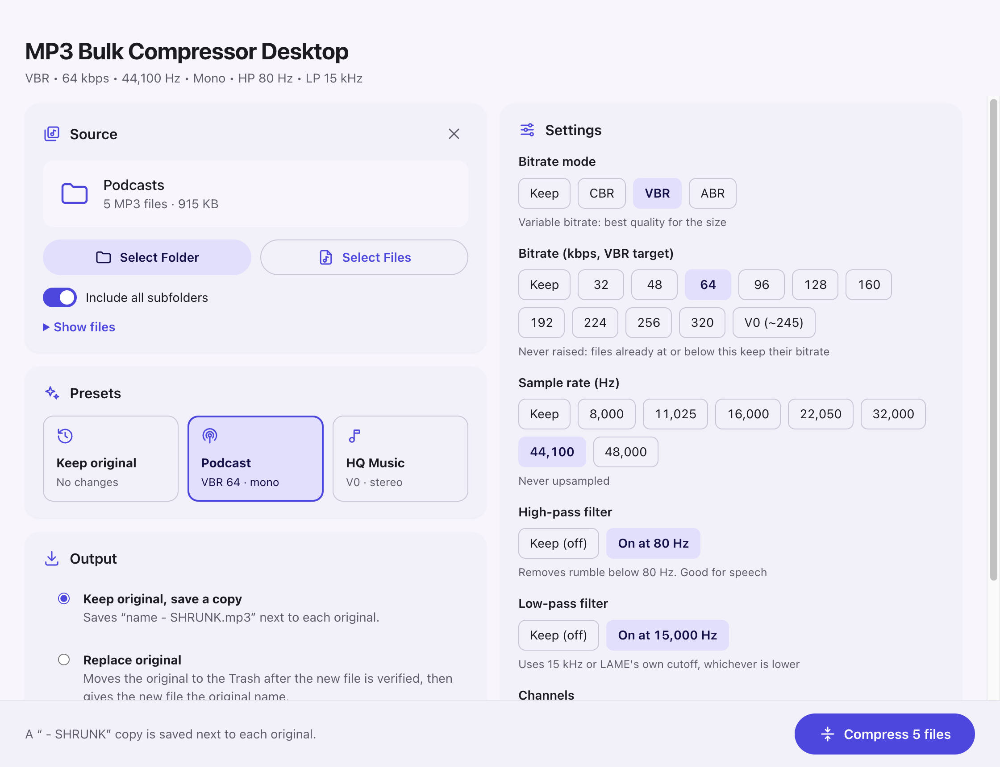
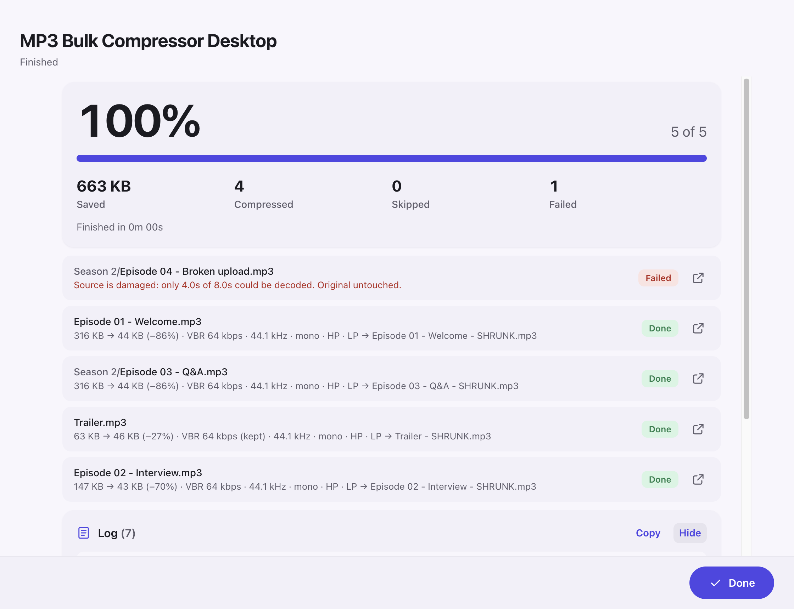

# MP3 Bulk Compressor Desktop

A Mac and Windows app that shrinks MP3 files in bulk. Point it at a folder (optionally with all its subfolders) or pick some MP3s, choose how much to compress, and it re-encodes each file with the LAME encoder. Every new file is checked before anything happens to the original.

This is the desktop edition of the [MP3 Bulk Compressor Android app](https://github.com/tdeletto/MP3-Bulk-Compressor). It uses the same encoder, presets and safety rules.

<p align="center">
  
</p>
<p align="center">
  
</p>

## Download and install

Installers are attached to each [GitHub Release](../../releases).

| System | File | Notes |
| --- | --- | --- |
| macOS 11+ on Apple Silicon (M1 or newer) | `MP3-Bulk-Compressor-Desktop-<version>-mac-arm64.dmg` | `.zip` also available |
| macOS 11+ on Intel | `MP3-Bulk-Compressor-Desktop-<version>-mac-x64.dmg` | `.zip` also available |
| Windows 10/11, 64-bit | `MP3-Bulk-Compressor-Desktop-Setup-<version>-win-x64.exe` | Installer. Most PCs |
| Windows 10/11, 64-bit, no install | `MP3-Bulk-Compressor-Desktop-Portable-<version>-win-x64.exe` | Portable: just run it |
| Windows 11 on ARM | `MP3-Bulk-Compressor-Desktop-Setup-<version>-win-arm64.exe` | Installer. Surface Pro X, Snapdragon laptops |
| Windows 11 on ARM, no install | `MP3-Bulk-Compressor-Desktop-Portable-<version>-win-arm64.exe` | Portable: just run it |

> Not sure which Mac you have? Choose  → **About This Mac**. "Chip: Apple M…" means Apple Silicon; "Processor: Intel" means Intel.

### macOS

1. Open the `.dmg` and drag **MP3 Bulk Compressor Desktop** into **Applications**.
2. Open it from Applications. The app isn't notarized by Apple yet, so macOS will block it the first time:
   - Open **System Settings → Privacy & Security**, scroll down to the message about MP3 Bulk Compressor Desktop, and click **Open Anyway**.
   - Or, in Terminal: `xattr -dr com.apple.quarantine "/Applications/MP3 Bulk Compressor Desktop.app"`
3. The first time you pick files in Downloads, Documents or Desktop, macOS asks for permission to access that folder. Click **Allow**.

To uninstall, drag the app from Applications to the Trash.

### Windows

1. Run `MP3-Bulk-Compressor-Desktop-Setup-<version>-win-x64.exe`.
2. The installer isn't code-signed yet, so SmartScreen may say *"Windows protected your PC"*. Click **More info → Run anyway**.
3. Choose where to install (a per-user install needs no administrator rights). The installer adds Start menu and desktop shortcuts.

To uninstall, use **Settings → Apps → Installed apps → MP3 Bulk Compressor Desktop → Uninstall**.

**Portable version:** download `MP3-Bulk-Compressor-Desktop-Portable-<version>-win-x64.exe` and double-click it. You can run it from anywhere, including a USB stick. Nothing is installed; delete the file to remove it. It takes a few seconds longer to start because it unpacks itself each time. SmartScreen may show the same *More info → Run anyway* prompt.

## Using it

1. **Pick what to compress**
   - **Select Folder** finds every MP3 in the folder. Turn on **Include all subfolders** to search the whole tree.
   - **Select Files** compresses the MP3s you choose.
   - Or **drag** files and folders onto the window. On a Mac you can also drop MP3s on the Dock icon, or right-click an MP3 in Finder and choose **Open With → MP3 Bulk Compressor Desktop**. The app doesn't become your default MP3 player.
   - **Show files** lists everything that was found.
2. **Choose settings**: click a preset or set each option yourself. The line under the title summarises your choice.
3. **Choose output**
   - **Keep original, save a copy** saves `name - SHRUNK.mp3` in the same folder.
   - **Replace original** moves the original to the **Trash** (Mac) or **Recycle Bin** (Windows) and gives the new file the original name. You're asked to confirm first.
4. Click **Compress**. Several files are processed at once. Progress also shows on the Dock or taskbar icon, and you get a notification when a long batch ends. Each file ends as **Done**, **Replaced**, **Kept both**, **Skip** (with the reason) or **Failed** (original untouched). Click the arrow beside a result to show it in Finder or File Explorer. The **Log** records every step and can be copied.

Your settings, output choice and subfolder switch are remembered between launches. The Mac won't sleep mid-batch. If you quit during a batch, the app asks first; stopping leaves every unfinished original untouched.

**Keyboard:** <kbd>⌘/Ctrl</kbd>+<kbd>O</kbd> selects a folder, <kbd>⌘/Ctrl</kbd>+<kbd>Shift</kbd>+<kbd>O</kbd> selects files.

## Settings

Every setting has a **Keep** option that uses each file's current value. With everything on Keep (the default), no file would change, so **Compress** stays disabled until you choose something.

| Setting | Options |
| --- | --- |
| Bitrate mode | Keep, CBR, VBR, ABR |
| Bitrate (kbps) | Keep, 32, 48, 64, 96, 128, 160, 192, 224, 256, 320; plus **V0 (~245)** in VBR mode |
| Sample rate (Hz) | Keep, 8,000, 11,025, 16,000, 22,050, 32,000, 44,100, 48,000 |
| High-pass filter | Keep (off), On at 80 Hz |
| Low-pass filter | Keep (off), On at 15,000 Hz |
| Channels | Keep, Full stereo, Joint stereo, Mono |

### Presets

| Preset | Mode | Bitrate | Sample rate | High-pass | Low-pass | Channels |
| --- | --- | --- | --- | --- | --- | --- |
| Keep original | Keep | Keep | Keep | Off | Off | Keep |
| **Podcast** | VBR | 64 kbps | 44,100 | On | On | Mono |
| **HQ Music** | VBR | V0 (~245 kbps) | 44,100 | Off | Off | Full stereo |

### Rules applied to every file

- **Bitrate is never raised.** A file already at or below the chosen bitrate keeps its own bitrate; the other settings still apply.
- **Nothing is upsampled**, and a **mono file stays mono** even if a stereo option is chosen. Stereo files stay stereo unless you pick Mono.
- **Files that wouldn't get smaller are skipped**, as are files where no setting would change anything.
- **Tags and cover art are kept.** The ID3v2 and ID3v1 tags are copied byte for byte.
- In VBR mode a bitrate is a target: it's mapped to a LAME quality level (V0–V9), so actual size depends on the audio. Speech usually comes in under the target.
- **Low-pass On** never raises the encoder's own cutoff; it uses whichever is lower, 15 kHz or LAME's default for that bitrate. **Off** leaves LAME's normal bitrate-based cutoff in place.
- Folder scans skip hidden files and folders and anything already named `… - SHRUNK.mp3`, so running the app twice on the same folder doesn't re-compress its own output.

## How files are kept safe

For each file:

1. Encode to a private temporary file.
2. Decode that file end to end and check it has the expected sample rate, channel count and length (within 0.25 s + 0.5% of the source). A damaged source that can't be fully decoded fails here.
3. Write it beside the original under a name that isn't taken (`name - SHRUNK.mp3`, `name - SHRUNK (1).mp3`, …), flush it to disk and read it back to confirm every byte (CRC-32).
4. Only for **Replace original**: move the original to the Trash / Recycle Bin, confirm it's gone, then rename the new file to the original name. If the Trash step fails (for example on a network drive without a Recycle Bin), both files are kept and the new one keeps its ` - SHRUNK` name.

Originals are never overwritten or permanently deleted. If anything fails, or you press **Stop**, any partly written output is removed and the original is left exactly as it was.

## Privacy

Everything happens on your computer. The app makes no network requests, collects no analytics, and only reads the files and folders you choose.

## Building from source

```bash
npm install
npm run build:engine   # native encoder helper (needs Xcode command line tools and/or zig)
npm start              # run the app
npm test               # unit + integration tests
npm run dist:mac       # macOS .dmg/.zip in dist/
npm run dist:win       # Windows installer in dist/ (works from macOS too)
```

See [docs/BUILDING.md](docs/BUILDING.md) for requirements, testing, code signing and releases, and [docs/ARCHITECTURE.md](docs/ARCHITECTURE.md) for how the app is put together.

### Project layout

```
engine/
  mp3bulk_engine.c        Native helper: minimp3 decode → LAME encode, and output verification
  third_party/lame/       LAME 3.100 encoder source (LGPL), same copy as the Android app
  third_party/minimp3/    minimp3 decoder (CC0)
src/
  core/settings.js        Settings, presets and per-file planning rules (shared with the UI)
  core/probe.js           Reads MP3 headers: CBR/VBR/ABR, bitrate, rate, channels, tags, duration
  core/transcoder.js      Probe → plan → encode → verify → save → Trash/rename, for one file
  core/batch.js           Runs a batch on parallel workers and keeps the progress/log state
  core/files.js           Folder scanning, safe file naming and verified writes
  main/main.js            Electron main process: window, menus, dialogs, IPC, notifications
  main/preload.js         The small, typed API the sandboxed UI is allowed to call
  renderer/               The UI (plain HTML, CSS and JavaScript)
scripts/                  Engine build, icon and test-fixture generators
test/                     node:test suites, fixtures and the Playwright UI test
```

## License

MP3 Bulk Compressor Desktop is released under the [MIT License](LICENSE).

The bundled components keep their own open-source licenses; see [THIRD_PARTY_NOTICES.md](THIRD_PARTY_NOTICES.md):

- [LAME](https://lame.sourceforge.io/) 3.100: GNU LGPL 2
- [minimp3](https://github.com/lieff/minimp3): CC0 (public domain)
- [Electron](https://www.electronjs.org/): MIT
