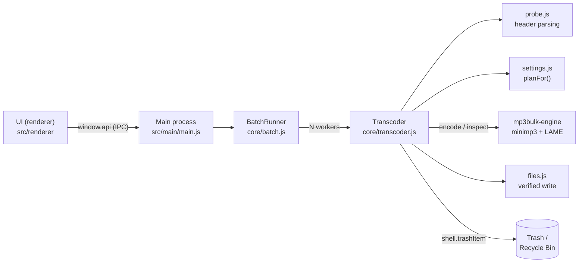

# Architecture

MP3 Bulk Compressor Desktop is an [Electron](https://www.electronjs.org) app with a small native helper. One codebase produces the macOS and Windows apps.



## Why this design

- **Same behaviour as the Android app.** `settings.js` and `probe.js` are line-for-line ports of `Settings.kt` and `Mp3Probe.kt`. The engine uses the Android app's LAME 3.100 source with the same encoder configuration (`lame_jni.c` → `configure()` in `mp3bulk_engine.c`), and the tests mirror the Android unit tests.
- **Native speed, simple portability.** Encoding runs in a separate process per file, so batches use several CPU cores and a crash or cancel can never take the UI down. The engine is plain C with no dependencies, so it builds for macOS with clang and for Windows (x64 and ARM64) with `zig cc` from any OS.
- **High-pass filter.** LAME's built-in high-pass works on its 32 polyphase bands and silently turns itself off below about 530 Hz (at 44.1 kHz). So `lame_set_highpassfreq(80)`, which the Android app uses, does nothing. The desktop engine instead applies a 2nd-order Butterworth high-pass at 80 Hz to the PCM before encoding, and `test/transcoder.test.js` checks that a 40 Hz rumble is actually attenuated.
- **Decoder.** Android decoded with `MediaCodec`. On desktop the engine uses [minimp3](https://github.com/lieff/minimp3): a single header, public domain, and it handles Xing/LAME gapless info. The same decoder checks every output end to end.

## One file, step by step (`Transcoder.process`)

| Step | Where | What happens | On problem |
| --- | --- | --- | --- |
| 1. Probe | `probe.js` | Reads ID3v2/ID3v1 sizes, the first frames and any Xing/Info/VBRI/LAME tag to find mode, bitrate, rate, channels and a trusted duration. Untagged VBR is measured by walking every frame header. | Failed: "Not a valid MP3" |
| 2. Plan | `settings.planFor` | Applies Keep / never-raise / never-upsample / mono-stays-mono rules. | Skipped when nothing would change |
| 3. Encode | engine `encode` | Decodes the audio byte range, downmixes if needed, encodes with LAME, copies the ID3v2 bytes before and ID3v1 bytes after, then patches the LAME/Xing header into the first frame (VBR/ABR). Writes to the OS temp folder. | Failed, temp removed |
| 4. Damage check | `transcoder.js` | Decoded length must be at least 98% − 0.5 s of the header-declared length. | Failed: "Source is damaged" |
| 5. Verify | engine `inspect` | Decodes the new file completely; rate, channels and length (±0.25 s + 0.5%) must match. | Failed: "Check failed: …" |
| 6. Size | `transcoder.js` | New file must be smaller than the original. | Skipped: "Wouldn't be smaller" |
| 7. Save | `files.writeVerifiedSibling` | Exclusive-creates `name - SHRUNK.mp3` (or `(1)`, `(2)`…), copies, `fsync`s, and re-reads to compare CRC-32 and length. | Failed, partial file removed |
| 8. Replace (optional) | `transcoder.replaceOriginal` | `shell.trashItem(original)`, confirms it's gone, renames the new file to the original name. | Kept both / note explaining why |

Cancelling aborts an `AbortSignal`: the engine process is killed, the temp file is removed, any staged output is deleted, and the file isn't reported.

## Processes and security

- The **renderer** is sandboxed (`sandbox: true`, `contextIsolation: true`, no Node integration) and has a strict Content-Security-Policy. It can only call the handful of functions in `preload.js`.
- The **main process** only compresses files from its own most recent scan (`currentFiles`), never paths sent directly by the UI. Settings from the UI pass through `sanitizeSettings`, and `reveal` only opens paths the app scanned or produced.
- Navigation and new windows are blocked. The app makes no network requests.

## Engine protocol

```
mp3bulk-engine encode IN OUT MODE KBPS RATE CHANNELS HIGHPASS LOWPASS AUDIO_START AUDIO_END
mp3bulk-engine inspect IN
mp3bulk-engine version
```

stdout, one line each: `progress 0.42` … then `result {json}` (exit 0) or `error message` (exit 1). On Windows, arguments are re-read as UTF-16 and files are opened with `_wfopen`, so any Unicode path works.

## Platform details

| | macOS | Windows |
| --- | --- | --- |
| Installer | `.dmg` (+ `.zip`), per architecture | NSIS `.exe`, per-user by default |
| Trash | Trash (`shell.trashItem`) | Recycle Bin (`shell.trashItem`) |
| Open from the OS | Dock drop; Finder "Open With" (registered as *Alternate*, never default) | Drag files onto the app/shortcut; single instance forwards them |
| Keep awake | `powerSaveBlocker('prevent-app-suspension')` | same |
| Progress outside the window | Dock icon progress bar, bounce, notification | Taskbar progress bar, notification |
